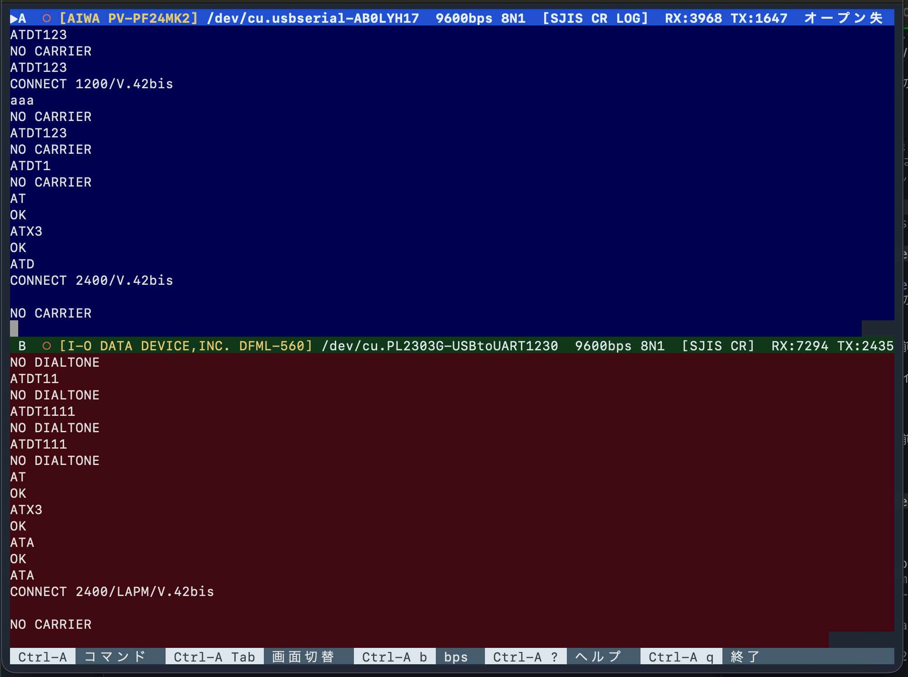

# null-term

パソコン通信用の 2 画面シリアルターミナル。画面を上下に分割し、USB-UART 2ch を同時に扱えます。



*上画面 (A) に aiwa PV-PF24MK2、下画面 (B) に I-O DATA DFML-560 を接続し、疑似交換機越しに `CONNECT 2400/V.42bis` で対向接続した様子*

## ビルドと起動

```
cargo build --release
./target/release/null-term --list                       # ポート一覧
./target/release/null-term /dev/cu.usbserial-A:2400 /dev/cu.usbserial-B:9600:7E1
```

ポート指定は `PATH[:BAUD[:FMT]]`（FMT 例: `8N1` `7E1`）。省略した画面は起動後に `Ctrl-A p` で選べます。

| オプション | 既定 | 説明 |
|---|---|---|
| `-b, --baud` | 9600 | bps の既定値 |
| `-e, --encoding` | sjis | sjis / utf8 / eucjp / jis |
| `-n, --newline` | cr | Enter で送る改行 (cr / crlf / lf) |
| `-f, --flow` | none | none / xon / rts |
| `--del` | | BackSpace で DEL(0x7F) を送る |
| `--echo` | | ローカルエコー ON |
| `--no-probe` | | 接続時に `ATI3` でモデム名を問い合わせない |
| `--headless` | | 画面なしで起動 (外部操作専用) |
| `-s, --socket` | | 外部操作ソケットのパス |

## キー操作（Ctrl-A のあとに押す）

| キー | 動作 |
|---|---|
| Tab / o / ↑↓ | 上下画面の切替 |
| 1 / 2 | A(上) / B(下) を選択 |
| b | bps 設定（一覧から選択、または数字で任意値） |
| p | ポート選択・接続 |
| r / x | ポートを再接続 / 閉じる |
| H | DTR を一瞬 OFF にしてモデムの回線を切断 |
| i | モデム名を取得 (`ATI3`) |
| e | 文字コード切替 |
| n | 改行コード切替 |
| h | BackSpace を BS/DEL 切替 |
| l | ローカルエコー |
| L | 受信ログを `null-term-A-日時.log` に保存 開始/停止 |
| c | 画面消去 |
| Ctrl-L | 表示が崩れたときに全体を描き直す |
| z | アクティブ画面を最大化 |
| [ / PgUp | スクロールバック（Esc で戻る） |
| Ctrl-A | 0x01 を送信 |
| ? | ヘルプ |
| q | 終了 |

画面は VT100/ANSI エスケープシーケンス（カラー含む）を解釈します。
上画面 (A) は紺、下画面 (B) はえんじの背景で表示し、タイトル行には接続状態・bps・データ形式・文字コード・送受信バイト数と、
接続時に `ATI3` で取得したモデム名を表示します。

## 外部からの操作（`null-term ctl`）

起動中の null-term は Unix ドメインソケットで外部からの操作を受け付けます。
ソケットの既定は `$TMPDIR/null-term-$USER.sock`（`--socket` か環境変数 `NULL_TERM_SOCK` で変更）。
画面なしで動かす場合は `--headless` を付けて起動します。

```sh
null-term --headless /dev/cu.usbserial-XXXX:2400 &      # 画面なし起動 (普通の TUI 起動中でも操作可)

null-term ctl send A 'AT\r' -x OK -t 3                  # 送信して "OK" を待ち、受信テキストを表示
null-term ctl send A 'ATDT2\r' -x 'CONNECT|NO CARRIER|BUSY' -t 60
null-term ctl wait A 'login:' -t 30                     # 直前の send/wait 以降の受信から正規表現を待つ
null-term ctl read A                                    # 前回以降の受信テキストを取得
null-term ctl screen A                                  # 画面の内容をテキストで取得
null-term ctl sendhex A 1b5b41                          # バイト列をそのまま送信
null-term ctl baud A 2400                               # bps 変更
null-term ctl open B /dev/cu.usbserial-YYYY -b 9600     # ポートを開く
null-term ctl status                                    # 状態 (JSON)
null-term ctl quit
```

- `send` のテキストは `\r` `\n` `\t` `\e` `\xNN` を展開し、そのチャンネルの文字コードに変換して送ります。改行の自動付加はしません。
- `wait` / `send -x` は一致すると 0、タイムアウトや切断で 1 を返して終了します。そこまでに受信したテキストは標準出力に出ます。
- チャンネルは `A` / `B`（`1` / `2` でも可）。
- `\N0` のように上記以外の `\X` はそのまま送られます（AT コマンドの `\N` 等に使えます）。
- 表示が崩れたら `ctl redraw`（描き直し）/ `ctl reset`（両画面を消去して描き直し）
- ほかのコマンド: `hangup` `format` `close` `identify` `encoding` `newline` `echo` `log` `clear` `focus` `ports` `raw`
- ソケットパスは macOS では 104 バイト程度が上限です。長いディレクトリを `--socket` に指定しないでください。

プロトコルは 1 行 1 つの JSON で、リクエストが `{"cmd":"send","ch":"A","data":"AT\r"}`、応答が `{"ok":true,...}` です。
`socat - UNIX-CONNECT:$SOCK` などから直接送ることもできます。

## 例: 疑似交換機でモデム 2 台をつなぐ

秋月電子の「(新)PIC 簡易疑似電話交換機キット」に 2 台のモデムを挿し、A/B 画面で対向通信させる例です。
（実績: A = aiwa PV-PF24MK2, B = I-O DATA DFML-560, 2400bps V.42bis で接続）

```sh
null-term /dev/cu.usbserial-XXXX:2400 /dev/cu.PL2303G-USBtoUART1230:2400
```

1. 両モデムを初期化: A/B それぞれで `AT&F`
2. 56k モデム側は速度を 2400 以下に制限（フォールバックは有効のまま）:
   `AT+MS=2,1,300,2400`
   - `AT+MS=2,0,2400,2400` のように固定すると、2400bps モデムが最初に 1200bps で呼びかけた時点で `INCOMPATIBLE SPEEDS` になり切れる
3. 発信側 (A): `ATX1S7=60DT0`（交換機はダイヤル番号を無視するので番号は何でもよい）
4. 着信側 (B): `RING` が出たら `ATA`。ベル検出が不安定な場合は `RING` を待たず、発信の数秒後に `ATA` を送る
5. `CONNECT 2400/V.42bis` が出たら上下の画面でそのまま文字をやり取りできる
6. 切断は次のどちらか
   - `Ctrl-A H`（または `null-term ctl hangup A`）: DTR を一瞬落として切る（モデムが `&D2` のとき。`AT&F` 後は通常これ）
   - 1 秒以上何も打たずに待つ → `+++`（Enter なし）→ 1 秒待って `OK` → `ATH0`

外部操作で行う場合:

```sh
P=null-term
$P ctl send A 'AT&F\r' -x OK;  $P ctl send B 'AT&F\r' -x OK
$P ctl send B 'AT+MS=2,1,300,2400\r' -x OK
$P ctl send A 'ATX1S7=60DT0\r' -x ATDT0
$P ctl wait B RING -t 6; $P ctl send B 'ATA\r' -x 'CONNECT' -t 70
$P ctl wait A 'CONNECT' -t 70
$P ctl send A 'Hello\r\n'; $P ctl wait B 'Hello' -t 10
```

うまくいかないときの確認:

- 片側だけ `ATX4DT0` で発信して `NO DIALTONE` になる → 交換機が発信音を出していない（オフフック検出・PIC 周りのハンダ不良を疑う）
- どちら向きでも `RING` が出ず `ATS1?` が 0 のまま → 交換機のベル回路（IC3 / T2 / リレー）を確認
- DFML-560 など Conexant 系は `AT&V1` で直前の切断理由（`TERMINATION REASON`）と受信速度が見られる
